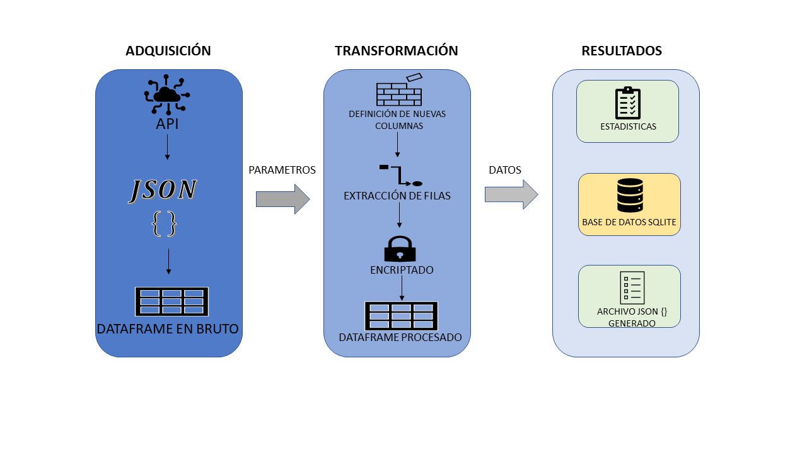

# zinobe-challenge
Prueba técnica para desarrollador backend con python.

## Diseño de la solución


## Requerimientos
- Python 3.6+

## Creación de ambiente virtual
Se recomienda crear un ambiente virtual. Para crearlo siga los siguientes pasos:
1. Instalar virtualenv: `pip install virtualenv`
2. Crear un ambiente virtual: `virtualenv venv`
3. Activar el ambiente virtual: `source venv/bin/activate`
4. Instalar dependencias: `pip install -r requirements.txt`

## Ejecución 
Para ejecutar el código se debe ejecutar el archivo `main.py` dentro del ambiente virtual con el siguiente comando: 

```
python main.py
```
